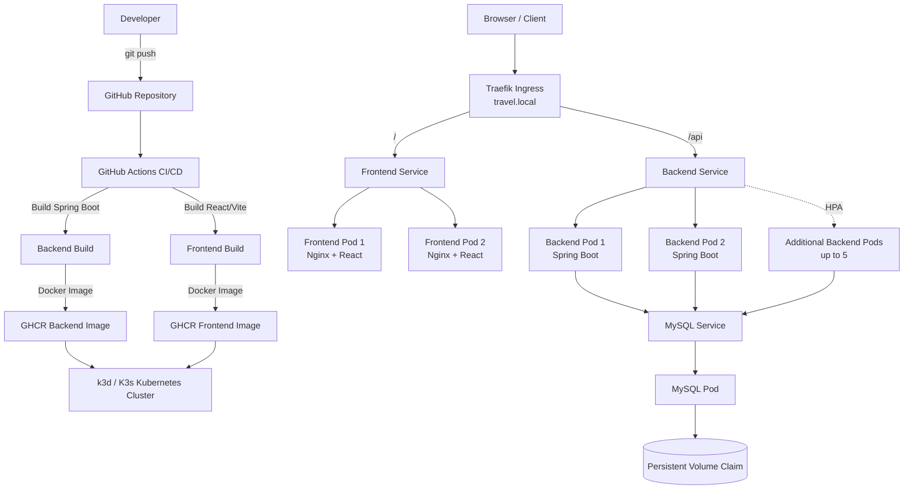

# 🌴 Sri Lanka Travel Agency — Cloud-Native DevOps & Kubernetes Platform

<div align="center">

[](https://github.com/Induwara09/Travelling_Agency_Web_App/actions)


**A full-stack Sri Lanka Travel Agency application, re-engineered with a production-style DevOps and Kubernetes workflow.**

</div>

---

## 📖 Overview

This project pairs a **React + Vite** frontend with a **Spring Boot** backend and a **MySQL** database, then wraps the whole stack in a real-world DevOps pipeline: **Docker** containerization, **GitHub Actions** CI/CD, image publishing to **GitHub Container Registry (GHCR)**, and deployment to a local **k3d/K3s** Kubernetes cluster behind **Traefik Ingress**.

It's built as a hands-on demonstration of practical DevOps and platform-engineering concepts — containerization, CI/CD automation, Kubernetes deployments, persistent storage, health probes, self-healing, horizontal pod autoscaling, multi-replica services, configuration/secret management, and unified ingress routing.

---

## 📑 Table of Contents

- [Technologies Used](#-technologies-used)
- [DevOps Features](#️-devops-features)
- [Project Structure](#-project-structure)
- [System Architecture](#️-system-architecture)
- [Getting Started](#-getting-started)
- [CI/CD Pipeline](#-cicd-pipeline)
- [Docker](#-docker)
- [Kubernetes Cluster](#️-kubernetes-cluster)
- [MySQL Deployment & Persistent Storage](#️-mysql-deployment)
- [Configuration & Secret Management](#-configmap-and-secret-management)
- [Backend Deployment](#-backend-kubernetes-deployment)
- [Frontend Deployment](#-frontend-kubernetes-deployment)
- [Traefik Ingress](#-traefik-ingress)
- [Health Probes](#️-readiness-and-liveness-probes)
- [Horizontal Pod Autoscaling](#-horizontal-pod-autoscaling)
- [Self-Healing](#️-kubernetes-self-healing)
- [Rolling Updates](#-rolling-updates)
- [Troubleshooting](#-health-and-troubleshooting-commands)
- [Security](#-security)
- [Project Result](#-project-result)
- [Screenshots](#-project-evidence--screenshots)
- [Learning Outcomes](#-key-devops-learning-outcomes)
- [Future Improvements](#-future-improvements)
- [Author & Repository](#-author)

---

## 🚀 Technologies Used

| Layer | Technology |
|---|---|
| **Frontend** | React, Vite, Nginx |
| **Backend** | Java 21, Spring Boot 3.3.4, Maven |
| **Database** | MySQL 8.4 |
| **Source Control** | Git, GitHub |
| **CI/CD** | GitHub Actions |
| **Containerization** | Docker |
| **Registry** | GitHub Container Registry (GHCR) |
| **Orchestration** | Kubernetes (k3d / K3s) |
| **Ingress** | Traefik |
| **Observability** | Spring Boot Actuator |
| **Scaling** | Horizontal Pod Autoscaler (HPA) |

---

## ⚙️ DevOps Features

- ✅ GitHub-based source control with a dedicated `devops-version-1` branch
- ✅ Automated Maven backend build via GitHub Actions
- ✅ Dockerized Spring Boot backend
- ✅ Multi-stage Dockerized React frontend, served via Nginx
- ✅ Backend & frontend images published to GHCR
- ✅ Kubernetes Deployments for backend, frontend, and MySQL
- ✅ Multiple replicas for both backend and frontend
- ✅ ClusterIP Services + Traefik Ingress routing
- ✅ Spring Boot Actuator readiness/liveness endpoints
- ✅ CPU/memory resource requests & limits
- ✅ Horizontal Pod Autoscaler with verified scale-up/scale-down
- ✅ Kubernetes self-healing (automatic pod replacement)
- ✅ MySQL persistent storage via PVC
- ✅ ConfigMap and Secret-based configuration management
- ✅ Rolling deployment support
- ✅ Full-stack routing through a single host
- ✅ CI/CD pipeline verified end-to-end

> **Note:** The CI/CD pipeline currently builds the backend with `-DskipTests`. Automated test execution is tracked as a future improvement.

---

## 📁 Project Structure

```text
Sri_Lanka_Travel_Agency_Full_Stack_V4/
│
├── .github/
│   └── workflows/
│       └── ci-cd.yml
│
├── database/
│
├── frontend/
│   ├── src/
│   ├── public/
│   ├── Dockerfile
│   ├── .dockerignore
│   ├── nginx.conf
│   ├── package.json
│   └── vite.config.js
│
├── kubernetes/
│   ├── backend-deployment.yaml
│   ├── configmap.yaml
│   ├── frontend-deployment.yaml
│   ├── hpa.yaml
│   ├── ingress.yaml
│   ├── mysql-deployment.yaml
│   └── mysql-pvc.yaml
│
├── images/
├── scripts/
│
├── travel/
│   ├── src/
│   ├── Dockerfile
│   ├── pom.xml
│   └── mvnw
│
├── .gitignore
└── README.md
```

> `kubernetes/secret.yaml`, local environment files, private keys, and build/dependency artifacts (`node_modules`, build output) are excluded from Git.

---

## 🏗️ System Architecture

<div align="center">
  
</div>

The flow: a developer pushes code → **GitHub Actions** checks it out, builds and tests it with **Maven**, then builds and pushes a **Docker** image to **GHCR**. Inside the **k3d/K3s** cluster, **Traefik Ingress** routes browser traffic to the Kubernetes Service in front of the Spring Boot pods. Those pods read configuration from a **ConfigMap** and credentials from a **Secret**, scale automatically via the **HPA** (2–5 replicas, 50% CPU target), and connect to a **MySQL** pod backed by a **Persistent Volume Claim** for durable storage.

<details>
<summary>📊 View as Mermaid diagram (text-based alternative)</summary>



</details>

---

## ▶️ Getting Started

A quick path from clone to running cluster:

```powershell
# 1. Clone the repository
git clone https://github.com/Induwara09/Travelling_Agency_Web_App.git
cd Travelling_Agency_Web_App
git checkout devops-version-1

# 2. Create the local Kubernetes cluster
k3d cluster create travel-cluster

# 3. Apply Kubernetes manifests
kubectl apply -f kubernetes/

# 4. Verify everything is running
kubectl get pods
kubectl get services
kubectl get ingress
```

**Prerequisites:** Docker Desktop, `k3d`/`K3s`, `kubectl`, Java 21, Node.js, and Maven (or the bundled `mvnw`).

---

## 🔄 CI/CD Pipeline

The project uses **GitHub Actions** for continuous integration and container image publishing, triggered on pushes to the `devops-version-1` branch.

### Pipeline Flow

| Step | Action |
|---|---|
| 1 | Checkout the repository |
| 2 | Configure Java 21 |
| 3 | Cache Maven dependencies |
| 4 | Grant execute permission to the Maven wrapper |
| 5 | Build the Spring Boot backend |
| 6 | Authenticate to GitHub Container Registry |
| 7 | Build the backend Docker image |
| 8 | Push the backend image to GHCR |
| 9 | Build the frontend Docker image |
| 10 | Push the frontend image to GHCR |

### Published Images

```text
ghcr.io/induwara09/travel-agency-backend:latest
ghcr.io/induwara09/travel-agency-backend:<commit-sha>

ghcr.io/induwara09/travel-agency-frontend:latest
ghcr.io/induwara09/travel-agency-frontend:<commit-sha>
```

This delivers a fully automated path: **source code → build → Docker image → container registry → Kubernetes-ready deployment.**

---

## 🐳 Docker

### Backend

Packaged from `travel/Dockerfile`, exposing container port **8080**.

```powershell
cd travel
.\mvnw.cmd clean package -DskipTests
docker build -t travel-agency-backend:1.0 .
```

### Frontend

Built using a **multi-stage Docker build**: Node.js compiles the Vite application, and Nginx serves the production build while also supporting React SPA routing and backend API proxying.

```powershell
cd frontend
npm ci
npm run build
docker build -t travel-agency-frontend:1.0 .
```

---

## ☸️ Kubernetes Cluster

The application runs on a local **k3d/K3s** cluster.

```powershell
# Create the cluster
k3d cluster create travel-cluster

# Inspect cluster state
kubectl get nodes
kubectl get pods
kubectl get deployments
kubectl get services
```

---

## 🗄️ MySQL Deployment

MySQL runs inside the cluster with the following configuration:

```text
Database: travel_db
Image:    mysql:8.4
Service:  mysql-service
```

```powershell
kubectl get pods
kubectl get service mysql-service
```

### 💾 Persistent Storage

A **PersistentVolumeClaim (PVC)** of `1Gi` decouples database storage from the MySQL pod's lifecycle, so data survives pod recreation.

```powershell
kubectl get pvc
```

Expected state: `STATUS: Bound`

---

## 🔐 ConfigMap and Secret Management

| Type | Purpose | Examples |
|---|---|---|
| **ConfigMap** | Non-sensitive configuration | `DB_URL`, `DB_USERNAME`, `DESTINATION_SEED_ENABLED` |
| **Secret** | Sensitive values | `MYSQL_ROOT_PASSWORD` |

Create the Secret safely (never commit real values):

```powershell
kubectl create secret generic mysql-secret `
  --from-literal=MYSQL_ROOT_PASSWORD="<YOUR_DB_PASSWORD>"
```

> Never commit real database passwords, tokens, API keys, `.env` files, private keys, or production secrets to Git.

---

## 🧩 Backend Kubernetes Deployment

```text
Minimum replicas: 2
Container port:   8080
Service:          travel-backend-service
```

```powershell
kubectl get deployment travel-backend
kubectl rollout status deployment/travel-backend
```

A successful rollout reports:

```text
deployment "travel-backend" successfully rolled out
```

---

## 🎨 Frontend Kubernetes Deployment

```text
Replicas:       2
Container port: 80
Service:        travel-frontend-service
```

```powershell
kubectl get deployment travel-frontend
kubectl rollout status deployment/travel-frontend
```

---

## 🌐 Traefik Ingress

**Traefik** exposes the full application through a single hostname, `travel.local`:

| Path | Routed To |
|---|---|
| `/` | `travel-frontend-service` |
| `/api` | `travel-backend-service` |

```powershell
kubectl get ingress
```

Expected resource: `travel-app-ingress`

### 🔌 Local Ingress Testing

Since the k3d cluster was created without a direct host port mapping, forward Traefik locally:

```powershell
kubectl port-forward -n kube-system service/traefik 8084:80
```

```powershell
# Frontend — expect HTML
curl.exe -H "Host: travel.local" http://localhost:8084/

# Backend — expect destination JSON
curl.exe -H "Host: travel.local" http://localhost:8084/api/destinations
```

---

## ❤️ Readiness and Liveness Probes

Spring Boot Actuator health endpoints drive Kubernetes health monitoring:

| Probe | Endpoint | Purpose |
|---|---|---|
| **Readiness** | `/actuator/health/readiness` | Is the pod ready to receive traffic? |
| **Liveness** | `/actuator/health/liveness` | Is the application alive and healthy? |

Kubernetes automatically restarts unhealthy containers, improving overall reliability and availability.

---

## 📈 Horizontal Pod Autoscaling

```text
Minimum replicas:       2
Maximum replicas:       5
Target CPU utilization: 50%
```

```powershell
kubectl get hpa
kubectl top pods
```

### 🧪 Load Testing

Generate temporary load from PowerShell:

```powershell
1..20 | ForEach-Object {
    Start-Job {
        while ($true) {
            try {
                Invoke-WebRequest -UseBasicParsing `
                  http://localhost:8081/api/destinations | Out-Null
            } catch {}
        }
    }
}
```

```powershell
# Watch scaling in real time
kubectl get hpa -w

# Stop the load
Get-Job | Stop-Job
Get-Job | Remove-Job
```

During testing, the deployment scaled **2 → 3 → 5 replicas** under load, then returned to **2 replicas** once load was removed and the stabilization window completed.

---

## 🛠️ Kubernetes Self-Healing

Kubernetes continuously maintains the desired replica count.

```powershell
kubectl get pods
kubectl delete pod <backend-pod-name>
kubectl get pods -w
```

Deleting a backend pod triggers automatic replacement by the Deployment controller — confirming self-healing and improved availability.

---

## 🔄 Rolling Updates

```powershell
kubectl rollout status deployment/travel-backend
kubectl rollout status deployment/travel-frontend
```

Rolling updates let new versions roll out while existing replicas continue serving traffic.

---

## 🩺 Health and Troubleshooting Commands

| Task | Command |
|---|---|
| View pod status | `kubectl get pods` |
| Describe a pod | `kubectl describe pod <pod-name>` |
| View logs | `kubectl logs <pod-name>` |
| View previous crash logs | `kubectl logs <pod-name> --previous` |
| View cluster events | `kubectl get events --sort-by=.lastTimestamp` |
| Check services | `kubectl get services` |
| Check ingress | `kubectl get ingress` |
| Check autoscaling | `kubectl get hpa` |
| Check persistent storage | `kubectl get pvc` |
| Check resource usage | `kubectl top pods` |

### 🔎 Common Pod States

| Status | Meaning | First Check |
|---|---|---|
| `Pending` | Scheduling, resource, or storage issue | `kubectl describe pod <name>` |
| `ContainerCreating` | Image, network, or volume setup | `kubectl describe pod <name>` |
| `ErrImagePull` | Kubernetes could not pull the image | Check registry/image/DNS |
| `ImagePullBackOff` | Repeated image pull failure | Inspect pod events |
| `CrashLoopBackOff` | Application repeatedly crashes | `kubectl logs <name> --previous` |
| `Running 0/1` | Container running but not Ready | Check readiness probe |
| `Running 1/1` | Pod healthy and Ready | Normal |

---

## 🔐 Security

- Database configuration is fully externalized
- Sensitive values live in Kubernetes **Secrets**; non-sensitive values in **ConfigMaps**
- Runtime configuration is environment-variable driven
- No real credentials are committed to YAML
- `.env` files, private keys, and `kubernetes/secret.yaml` are excluded from Git
- GitHub Actions uses the repository-provided `GITHUB_TOKEN` for GHCR publishing

---

## ✅ Project Result

The Sri Lanka Travel Agency application was successfully:

- Built with React, Spring Boot, Maven, and MySQL
- Containerized with Docker and published to GHCR
- Integrated with GitHub Actions CI/CD
- Deployed to Kubernetes via k3d/K3s with multiple frontend and backend replicas
- Connected to MySQL running inside the cluster with persistent storage
- Secured with Kubernetes Secrets and configured via ConfigMaps
- Monitored through Spring Boot Actuator readiness/liveness probes
- Verified for self-healing and scaled up to five backend replicas under load
- Exposed and tested end-to-end through Traefik Ingress
- Confirmed via a fully passing GitHub Actions pipeline

---

## 📸 Project Evidence / Screenshots

Live captures from the running cluster, confirming every layer of the stack is healthy end to end.

### ☸️ Kubernetes Pods

All backend, frontend, and MySQL pods `Running` with `1/1` readiness across the k3d cluster:

<div align="center">
  
</div>

### 🚀 Deployment Rollout

The `travel-backend` Deployment rolling out successfully:

<div align="center">
  
</div>

### 🌐 Traefik Ingress

The `travel-app-ingress` resource routing `travel.local` through Traefik:

<div align="center">
  
</div>

### 🗄️ MySQL Persistent Storage

The `mysql-pvc` claim `Bound` at `1Gi` on the `local-path` storage class:

<div align="center">
  
</div>

<details>
<summary>➕ Additional screenshots (add as captured)</summary>

To extend this section, drop new images into `docs/screenshots/` and reference them the same way:

```text
docs/screenshots/
├── github-actions-success.png
├── kubernetes-hpa.png
├── backend-api-success.png
├── frontend-kubernetes.png
└── website-home.png
```

```markdown


```

</details>

---

## 🧠 Key DevOps Learning Outcomes

- Git branching and repository management
- Environment-based configuration
- Docker image creation & multi-stage frontend builds
- GitHub Actions workflow development
- GitHub Container Registry publishing
- Kubernetes Deployments and Services
- Persistent database storage
- Kubernetes Secrets and ConfigMaps
- Health checks, probes, and self-healing
- Horizontal Pod Autoscaling
- Traefik Ingress routing
- CI/CD and Kubernetes troubleshooting
- Full-stack application deployment, end to end

---

## 🔮 Future Improvements

- [ ] Run automated backend tests in GitHub Actions
- [ ] Add frontend linting and automated tests
- [ ] Use immutable image tags in Kubernetes manifests
- [ ] Add Helm or Kustomize for manifest management
- [ ] Add Prometheus and Grafana for monitoring
- [ ] Add centralized logging
- [ ] Add HTTPS/TLS with a real domain name
- [ ] Deploy to AWS EKS, Azure AKS, or Google GKE
- [ ] Manage infrastructure with Terraform
- [ ] Adopt an external secret manager for production

---

## 👨‍💻 Author

**Induwara**
Computer Systems Engineering Undergraduate
Sri Lanka Institute of Information Technology (SLIIT)

[](https://github.com/Induwara09)

---

## 📌 Repository

| | |
|---|---|
| **Repository** | [Induwara09/Travelling_Agency_Web_App](https://github.com/Induwara09/Travelling_Agency_Web_App) |
| **DevOps Branch** | `devops-version-1` |

---

<div align="center">

*This repository is an educational DevOps project demonstrating how a full-stack application moves from local development to a containerized, automated, and Kubernetes-managed deployment environment.*

</div>
