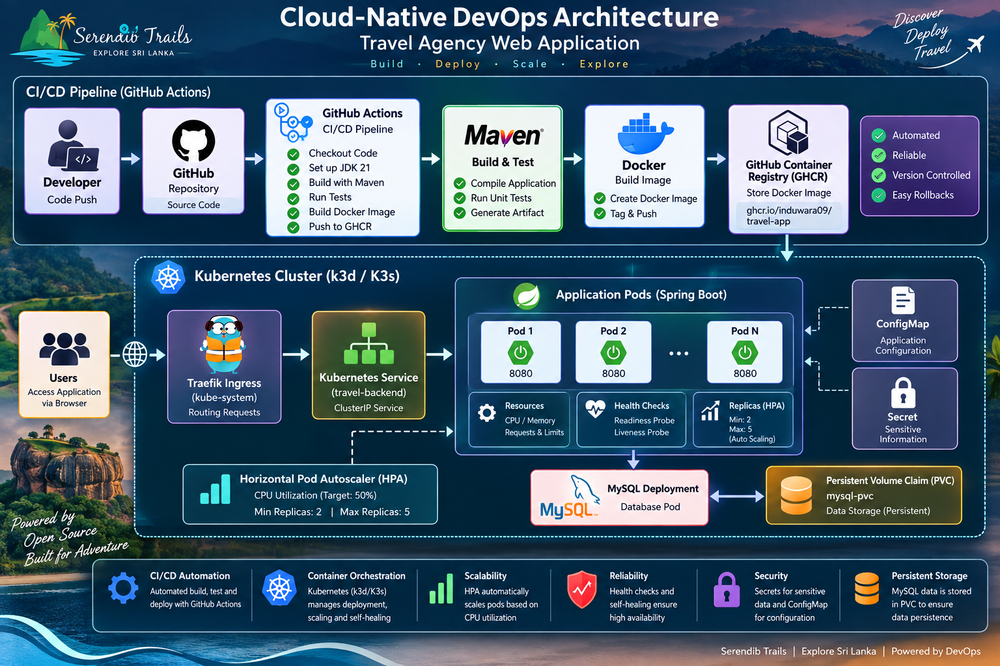
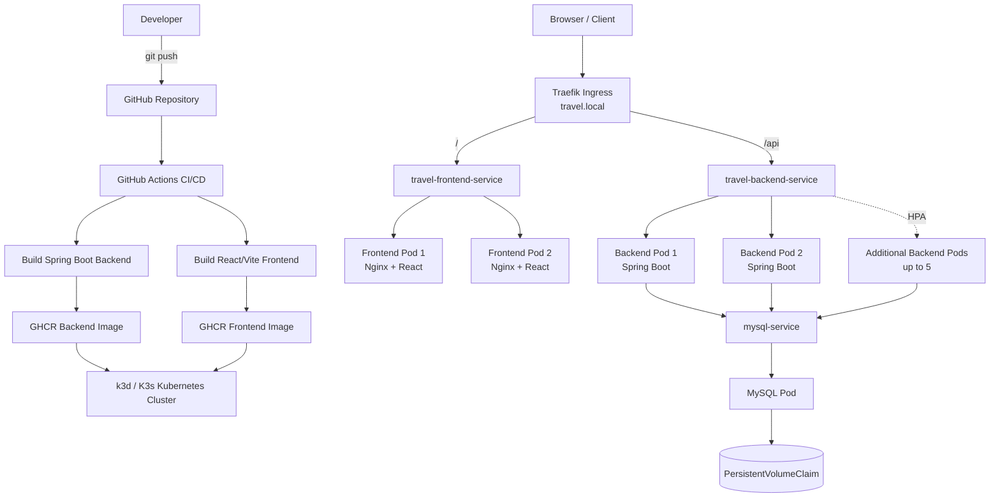
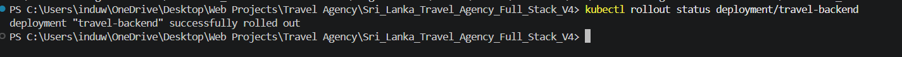
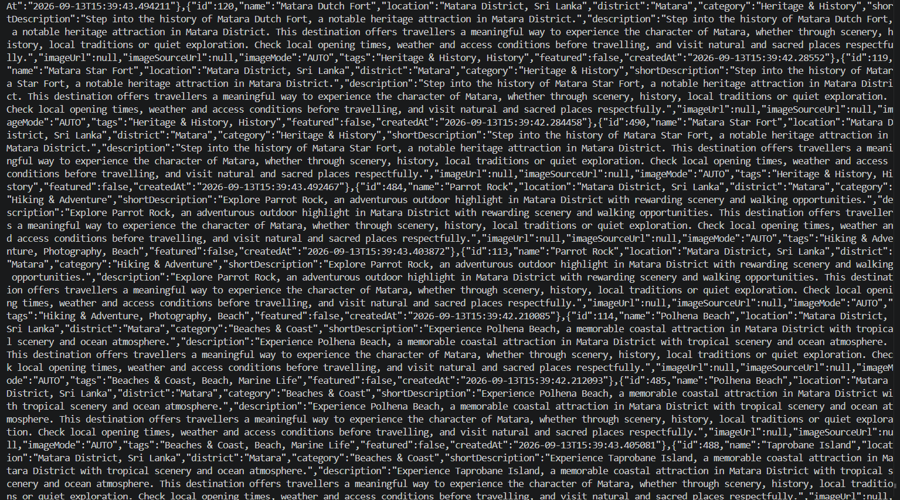

# 🌴 Sri Lanka Travel Agency — Cloud-Native DevOps & Kubernetes Platform

<div align="center">

[](https://github.com/Induwara09/Travelling_Agency_Web_App/actions)


**A full-stack Sri Lanka Travel Agency application re-engineered with a production-style DevOps and Kubernetes workflow.**

</div>

---

<a id="overview"></a>
## 📖 Overview

This project combines a **React + Vite frontend**, a **Spring Boot backend**, and a **MySQL database** with a practical DevOps workflow built around **Docker**, **GitHub Actions**, **GitHub Container Registry (GHCR)**, **Kubernetes**, **k3d/K3s**, and **Traefik Ingress**.

The project demonstrates how a full-stack application can move from local development into a containerized and Kubernetes-managed environment with:

- CI/CD automation
- Backend and frontend containerization
- Container image publishing to GHCR
- Kubernetes Deployments and Services
- Multiple application replicas
- MySQL persistent storage
- ConfigMaps and Secrets
- Spring Boot Actuator health probes
- Kubernetes self-healing
- Horizontal Pod Autoscaling
- Traefik Ingress routing
- End-to-end deployment verification

> **Scope:** This is a production-style **local Kubernetes implementation** using k3d/K3s. It demonstrates production DevOps concepts, but it is not an internet-facing cloud production deployment such as EKS, AKS, or GKE.

---

<a id="table-of-contents"></a>
## 📑 Table of Contents

- [Technologies Used](#technologies-used)
- [DevOps Features](#devops-features)
- [Project Structure](#project-structure)
- [System Architecture](#system-architecture)
- [Getting Started](#getting-started)
- [CI/CD Pipeline](#cicd-pipeline)
- [Docker](#docker)
- [Kubernetes Cluster](#kubernetes-cluster)
- [MySQL Deployment](#mysql-deployment)
- [Persistent Storage](#persistent-storage)
- [ConfigMap and Secret Management](#configmap-and-secret-management)
- [Backend Kubernetes Deployment](#backend-kubernetes-deployment)
- [Frontend Kubernetes Deployment](#frontend-kubernetes-deployment)
- [Traefik Ingress](#traefik-ingress)
- [Readiness and Liveness Probes](#readiness-and-liveness-probes)
- [Horizontal Pod Autoscaling](#horizontal-pod-autoscaling)
- [Kubernetes Self-Healing](#kubernetes-self-healing)
- [Rolling Updates](#rolling-updates)
- [Troubleshooting](#troubleshooting)
- [Security](#security)
- [Project Result](#project-result)
- [Project Evidence](#project-evidence)
- [Learning Outcomes](#learning-outcomes)
- [Future Improvements](#future-improvements)
- [Author](#author)
- [Repository](#repository)

---

<a id="technologies-used"></a>
## 🚀 Technologies Used

| Layer | Technology |
|---|---|
| **Frontend** | React, Vite, Nginx |
| **Backend** | Java 21, Spring Boot 3.3.4, Maven |
| **Database** | MySQL 8.4 |
| **Source Control** | Git, GitHub |
| **CI/CD** | GitHub Actions |
| **Containerization** | Docker |
| **Registry** | GitHub Container Registry (GHCR) |
| **Orchestration** | Kubernetes |
| **Local Kubernetes** | k3d / K3s |
| **Ingress** | Traefik |
| **Health Monitoring** | Spring Boot Actuator |
| **Autoscaling** | Horizontal Pod Autoscaler (HPA) |

---

<a id="devops-features"></a>
## ⚙️ DevOps Features

- ✅ Dedicated `devops-version-1` branch for DevOps work
- ✅ Automated Maven backend build using GitHub Actions
- ✅ Dockerized Spring Boot backend
- ✅ Multi-stage Dockerized React frontend
- ✅ Nginx production frontend server
- ✅ Backend Docker image publishing to GHCR
- ✅ Frontend Docker image publishing to GHCR
- ✅ Kubernetes backend Deployment
- ✅ Kubernetes frontend Deployment
- ✅ Multiple backend replicas
- ✅ Multiple frontend replicas
- ✅ Kubernetes ClusterIP Services
- ✅ Traefik Ingress routing
- ✅ Spring Boot Actuator health endpoints
- ✅ Kubernetes readiness probes
- ✅ Kubernetes liveness probes
- ✅ CPU and memory resource requests and limits
- ✅ Horizontal Pod Autoscaler
- ✅ Kubernetes self-healing
- ✅ MySQL running inside Kubernetes
- ✅ MySQL persistent storage using PVC
- ✅ Kubernetes ConfigMap
- ✅ Kubernetes Secret management
- ✅ Environment-variable based application configuration
- ✅ Rolling Deployment support
- ✅ Full-stack `/` and `/api` routing
- ✅ End-to-end Kubernetes verification
- ✅ GitHub Actions pipeline verified successfully

> **Current CI note:** The backend is currently built using `-DskipTests`. Automated backend test execution is listed as a future improvement.

---

<a id="project-structure"></a>
## 📁 Project Structure

```text
Sri_Lanka_Travel_Agency_Full_Stack_V4/
│
├── .github/
│   └── workflows/
│       └── ci-cd.yml
│
├── database/
│
├── docs/
│   └── screenshots/
│       ├── api-success.png
│       ├── architecture.png
│       ├── deployment-rollout.png
│       ├── kubernetes-hpa.png
│       ├── kubernetes-ingress.png
│       ├── kubernetes-pods.png
│       └── mysql-pvc.png
│
├── frontend/
│   ├── public/
│   ├── src/
│   ├── .dockerignore
│   ├── Dockerfile
│   ├── nginx.conf
│   ├── package.json
│   └── vite.config.js
│
├── kubernetes/
│   ├── backend-deployment.yaml
│   ├── configmap.yaml
│   ├── frontend-deployment.yaml
│   ├── hpa.yaml
│   ├── ingress.yaml
│   ├── mysql-deployment.yaml
│   └── mysql-pvc.yaml
│
├── images/
├── scripts/
│
├── travel/
│   ├── src/
│   ├── Dockerfile
│   ├── mvnw
│   └── pom.xml
│
├── .gitignore
└── README.md
```

> `kubernetes/secret.yaml`, local environment files, private keys, frontend build output, backend build output, and `node_modules` are excluded from Git where appropriate.

---

<a id="system-architecture"></a>
## 🏗️ System Architecture

<div align="center">
  
</div>

The architecture image is a visual overview of the project. The exact implemented full-stack routing is shown below.

```text
Developer
   │
   ▼
GitHub Repository
   │
   ▼
GitHub Actions CI/CD
   │
   ├── Build Spring Boot backend
   ├── Build backend Docker image
   ├── Push backend image to GHCR
   ├── Build React/Vite frontend image
   └── Push frontend image to GHCR
            │
            ▼
      k3d / K3s Cluster
            │
            ▼
      Traefik Ingress
       /          /api
       │            │
       ▼            ▼
Frontend Service   Backend Service
       │            │
       ▼            ▼
React + Nginx      Spring Boot Pods
Pods (2)           Pods (2–5 via HPA)
                       │
                       ▼
                  MySQL Service
                       │
                       ▼
                  MySQL Pod
                       │
                       ▼
                  Persistent PVC
```

### Mermaid Architecture

<details>
<summary>View the text-based architecture diagram</summary>



</details>

---

<a id="getting-started"></a>
## ▶️ Getting Started

### Prerequisites

Install or configure:

- Docker Desktop
- Git
- Java 21
- Node.js and npm
- kubectl
- k3d
- GitHub access to this repository

### 1. Clone the Repository

```powershell
git clone https://github.com/Induwara09/Travelling_Agency_Web_App.git
cd Travelling_Agency_Web_App
git checkout devops-version-1
```

### 2. Create the Kubernetes Cluster

```powershell
k3d cluster create travel-cluster
```

Verify:

```powershell
kubectl get nodes
```

### 3. Create the MySQL Secret

The real database password is intentionally not committed to Git.

```powershell
kubectl create secret generic mysql-secret `
  --from-literal=MYSQL_ROOT_PASSWORD="<YOUR_DB_PASSWORD>"
```

Verify the Secret metadata:

```powershell
kubectl describe secret mysql-secret
```

### 4. Apply Kubernetes Resources in Order

```powershell
kubectl apply -f kubernetes/mysql-pvc.yaml
kubectl apply -f kubernetes/mysql-deployment.yaml
kubectl apply -f kubernetes/configmap.yaml
kubectl apply -f kubernetes/backend-deployment.yaml
kubectl apply -f kubernetes/hpa.yaml
kubectl apply -f kubernetes/frontend-deployment.yaml
kubectl apply -f kubernetes/ingress.yaml
```

### 5. Verify the Cluster

```powershell
kubectl get pods
kubectl get deployments
kubectl get services
kubectl get pvc
kubectl get hpa
kubectl get ingress
```

### 6. Forward Traefik for Local Access

```powershell
kubectl port-forward -n kube-system service/traefik 8084:80
```

Keep that terminal open.

### 7. Test the Frontend

Open a second terminal:

```powershell
curl.exe -H "Host: travel.local" http://localhost:8084/
```

Expected result: frontend HTML.

### 8. Test the Backend API

```powershell
curl.exe -H "Host: travel.local" http://localhost:8084/api/destinations
```

Expected result: destination JSON data.

---

<a id="cicd-pipeline"></a>
## 🔄 CI/CD Pipeline

The project uses **GitHub Actions** for Continuous Integration and container image publishing.

The workflow runs on pushes and pull requests targeting:

```text
devops-version-1
```

### Pipeline Flow

| Step | Action |
|---|---|
| 1 | Checkout the repository |
| 2 | Configure Java 21 |
| 3 | Cache Maven dependencies |
| 4 | Grant execute permission to the Maven wrapper |
| 5 | Build the Spring Boot backend |
| 6 | Authenticate to GitHub Container Registry on push |
| 7 | Build and push the backend Docker image |
| 8 | Build and push the frontend Docker image |

### Published Images

Backend:

```text
ghcr.io/induwara09/travel-agency-backend:latest
ghcr.io/induwara09/travel-agency-backend:<commit-sha>
```

Frontend:

```text
ghcr.io/induwara09/travel-agency-frontend:latest
ghcr.io/induwara09/travel-agency-frontend:<commit-sha>
```

The automated path is:

```text
Source Code
    ↓
GitHub
    ↓
GitHub Actions
    ↓
Maven / Frontend Build
    ↓
Docker Build
    ↓
GitHub Container Registry
    ↓
Kubernetes-ready Images
```

---

<a id="docker"></a>
## 🐳 Docker

### Backend

The Spring Boot backend is packaged using:

```text
travel/Dockerfile
```

The backend container exposes:

```text
8080
```

Build locally:

```powershell
cd travel
.\mvnw.cmd clean package -DskipTests
docker build -t travel-agency-backend:1.0 .
```

### Frontend

The frontend uses a **multi-stage Docker build**.

- Node.js installs dependencies and builds the Vite application.
- Nginx serves the generated production files.
- React SPA routing is supported using Nginx.
- The production frontend uses same-origin API paths.

Build locally:

```powershell
cd frontend
npm ci
npm run build
docker build -t travel-agency-frontend:1.0 .
```

---

<a id="kubernetes-cluster"></a>
## ☸️ Kubernetes Cluster

The project runs on a local Kubernetes cluster using **k3d/K3s**.

Create the cluster:

```powershell
k3d cluster create travel-cluster
```

Useful checks:

```powershell
k3d cluster list
kubectl get nodes
kubectl cluster-info
kubectl get pods -A
```

The cluster used in this project was created without an explicit Windows host port mapping for Traefik. Local access is therefore demonstrated using `kubectl port-forward`.

---

<a id="mysql-deployment"></a>
## 🗄️ MySQL Deployment

MySQL runs inside the Kubernetes cluster.

Configuration:

```text
Database : travel_db
Image    : mysql:8.4
Service  : mysql-service
Port     : 3306
```

Check MySQL:

```powershell
kubectl get pods
kubectl get service mysql-service
```

The Spring Boot backend connects to MySQL using the internal Kubernetes hostname:

```text
mysql-service:3306
```

---

<a id="persistent-storage"></a>
## 💾 Persistent Storage

A **PersistentVolumeClaim (PVC)** is used so database data is not tied to the lifecycle of one MySQL pod.

Configured storage:

```text
1Gi
```

Check the PVC:

```powershell
kubectl get pvc
```

Expected status:

```text
Bound
```

<div align="center">
  
</div>

---

<a id="configmap-and-secret-management"></a>
## 🔐 ConfigMap and Secret Management

| Type | Purpose | Examples |
|---|---|---|
| **ConfigMap** | Non-sensitive application configuration | `DB_URL`, `DB_USERNAME`, `DESTINATION_SEED_ENABLED` |
| **Secret** | Sensitive values | `MYSQL_ROOT_PASSWORD` |

The ConfigMap stores values such as:

```text
DB_URL=jdbc:mysql://mysql-service:3306/travel_db...
DB_USERNAME=root
DESTINATION_SEED_ENABLED=false
```

The MySQL password is created directly in the cluster instead of being committed to the repository.

```powershell
kubectl create secret generic mysql-secret `
  --from-literal=MYSQL_ROOT_PASSWORD="<YOUR_DB_PASSWORD>"
```

> Never commit real passwords, tokens, API keys, private keys, or production credentials to Git.

---

<a id="backend-kubernetes-deployment"></a>
## 🧩 Backend Kubernetes Deployment

Backend configuration:

```text
Deployment : travel-backend
Replicas   : 2 minimum
Port       : 8080
Service    : travel-backend-service
```

Apply:

```powershell
kubectl apply -f kubernetes/backend-deployment.yaml
```

Check:

```powershell
kubectl get deployment travel-backend
kubectl get pods
kubectl rollout status deployment/travel-backend
```

Successful rollout:

```text
deployment "travel-backend" successfully rolled out
```

<div align="center">
  
</div>

---

<a id="frontend-kubernetes-deployment"></a>
## 🎨 Frontend Kubernetes Deployment

Frontend configuration:

```text
Deployment : travel-frontend
Replicas   : 2
Port       : 80
Service    : travel-frontend-service
```

Apply:

```powershell
kubectl apply -f kubernetes/frontend-deployment.yaml
```

Check:

```powershell
kubectl get deployment travel-frontend
kubectl rollout status deployment/travel-frontend
```

The frontend pods run **Nginx**, which serves the production React/Vite build.

---

<a id="traefik-ingress"></a>
## 🌐 Traefik Ingress

**Traefik Ingress** exposes the full application through one host:

```text
travel.local
```

Routing:

| Path | Routed To |
|---|---|
| `/` | `travel-frontend-service` |
| `/api` | `travel-backend-service` |

Check the Ingress:

```powershell
kubectl get ingress
```

Expected final Ingress resource:

```text
travel-app-ingress
```

<div align="center">
  
</div>

### Local Ingress Testing

```powershell
kubectl port-forward -n kube-system service/traefik 8084:80
```

Frontend:

```powershell
curl.exe -H "Host: travel.local" http://localhost:8084/
```

Backend:

```powershell
curl.exe -H "Host: travel.local" http://localhost:8084/api/destinations
```

---

<a id="readiness-and-liveness-probes"></a>
## ❤️ Readiness and Liveness Probes

Spring Boot Actuator provides Kubernetes-compatible health endpoints.

| Probe | Endpoint | Purpose |
|---|---|---|
| **Readiness** | `/actuator/health/readiness` | Checks whether the pod is ready to receive traffic |
| **Liveness** | `/actuator/health/liveness` | Checks whether the application is alive and healthy |

If readiness fails, Kubernetes removes the pod from active Service traffic.

If liveness repeatedly fails, Kubernetes can restart the container.

This improves application reliability and availability.

---

<a id="horizontal-pod-autoscaling"></a>
## 📈 Horizontal Pod Autoscaling

The backend uses a **Horizontal Pod Autoscaler (HPA)**.

Configuration:

```text
Minimum replicas       : 2
Maximum replicas       : 5
Target CPU utilization : 50%
```

Check HPA:

```powershell
kubectl get hpa
```

Check CPU and memory:

```powershell
kubectl top pods
```

<div align="center">
  
</div>

During load testing, the backend successfully scaled:

```text
2 replicas
    ↓
3 replicas
    ↓
5 replicas
```

After load was removed and the HPA stabilization period completed, Kubernetes returned the backend to:

```text
2 replicas
```

### HPA Load Test

First forward the backend Service:

```powershell
kubectl port-forward service/travel-backend-service 8081:8080
```

Generate temporary load in another PowerShell terminal:

```powershell
1..20 | ForEach-Object {
    Start-Job {
        while ($true) {
            try {
                Invoke-WebRequest -UseBasicParsing `
                  http://localhost:8081/api/destinations | Out-Null
            } catch {}
        }
    }
}
```

Watch HPA:

```powershell
kubectl get hpa -w
```

Stop the load:

```powershell
Get-Job | Stop-Job
Get-Job | Remove-Job
```

---

<a id="kubernetes-self-healing"></a>
## 🛠️ Kubernetes Self-Healing

Kubernetes automatically maintains the desired number of backend replicas.

Self-healing was verified by deleting one backend pod:

```powershell
kubectl get pods
kubectl delete pod <backend-pod-name>
kubectl get pods -w
```

The Deployment controller automatically created a replacement pod and restored the backend to its required replica count.

This demonstrates:

- Automatic pod recovery
- Desired-state management
- Fault tolerance
- Improved availability

---

<a id="rolling-updates"></a>
## 🔄 Rolling Updates

Kubernetes Deployments support rolling updates.

Backend:

```powershell
kubectl rollout status deployment/travel-backend
```

Frontend:

```powershell
kubectl rollout status deployment/travel-frontend
```

Rolling updates allow Kubernetes to introduce new application versions while managing existing replicas during the rollout.

---

<a id="troubleshooting"></a>
## 🩺 Health and Troubleshooting Commands

| Task | Command |
|---|---|
| View pod status | `kubectl get pods` |
| View detailed pod information | `kubectl describe pod <pod-name>` |
| View application logs | `kubectl logs <pod-name>` |
| View previous crash logs | `kubectl logs <pod-name> --previous` |
| View cluster events | `kubectl get events --sort-by=.lastTimestamp` |
| Check deployments | `kubectl get deployments` |
| Check services | `kubectl get services` |
| Check Ingress | `kubectl get ingress` |
| Check HPA | `kubectl get hpa` |
| Check PVC | `kubectl get pvc` |
| Check resource usage | `kubectl top pods` |

### Common Pod States

| Status | Meaning | First Check |
|---|---|---|
| `Pending` | Scheduling, storage, or resource issue | `kubectl describe pod <name>` |
| `ContainerCreating` | Image, network, or volume setup | `kubectl describe pod <name>` |
| `ErrImagePull` | Kubernetes could not pull the image | Check image, registry, and DNS |
| `ImagePullBackOff` | Repeated image pull failure | Inspect pod events |
| `CrashLoopBackOff` | Application repeatedly crashes | `kubectl logs <name> --previous` |
| `Running 0/1` | Container is running but not Ready | Check readiness probe |
| `Running 1/1` | Pod is healthy and Ready | Normal |

---

<a id="security"></a>
## 🔐 Security

The project follows these security practices:

- Database configuration is externalized.
- Kubernetes Secrets are used for sensitive values.
- ConfigMaps are used for non-sensitive configuration.
- Runtime configuration is environment-variable driven.
- Real database credentials are not stored in committed Kubernetes YAML.
- `.env` files are excluded from Git.
- `.pem` and `.key` files are excluded from Git.
- `kubernetes/secret.yaml` is excluded from Git.
- GitHub Actions uses the repository-provided `GITHUB_TOKEN` for GHCR publishing.

---

<a id="project-result"></a>
## ✅ Project Result

The Sri Lanka Travel Agency application was successfully:

- Built using React, Vite, Spring Boot, Maven, and MySQL
- Configured using environment variables
- Containerized using Docker
- Published to GitHub Container Registry
- Integrated with GitHub Actions CI/CD
- Deployed to Kubernetes using k3d/K3s
- Configured with two frontend replicas
- Configured with two backend replicas at normal load
- Connected to MySQL running inside Kubernetes
- Configured with persistent MySQL storage
- Protected using Kubernetes Secrets
- Configured using Kubernetes ConfigMaps
- Monitored using Spring Boot Actuator
- Configured with readiness probes
- Configured with liveness probes
- Tested for Kubernetes self-healing
- Configured with CPU and memory resource limits
- Configured with Horizontal Pod Autoscaling
- Successfully scaled to five backend replicas under load
- Automatically scaled back down after load testing
- Exposed through Traefik Ingress
- Configured with `/` frontend routing
- Configured with `/api` backend routing
- Successfully tested through the Kubernetes environment
- Verified with a successful GitHub Actions pipeline

---

<a id="project-evidence"></a>
## 📸 Project Evidence / Screenshots

The following screenshots were captured from the running project and provide evidence for the Kubernetes and DevOps implementation.

### 🏗️ System Architecture

<div align="center">
  
</div>

### ☸️ Kubernetes Pods

All MySQL, backend, and frontend pods were verified in `Running` state with `1/1` readiness.

<div align="center">
  
</div>

### 🚀 Backend Deployment Rollout

The `travel-backend` Deployment completed successfully.

<div align="center">
  
</div>

### 🌐 Traefik Ingress

The `travel-app-ingress` resource exposes `travel.local` through Traefik.

<div align="center">
  
</div>

### 📈 Horizontal Pod Autoscaler

The backend HPA is configured with a 50% CPU target, minimum 2 replicas, and maximum 5 replicas.

<div align="center">
  
</div>

### 🗄️ MySQL Persistent Storage

The `mysql-pvc` PersistentVolumeClaim was verified in `Bound` state.

<div align="center">
  
</div>

### ✅ Backend API Test

The backend `/api/destinations` endpoint was successfully accessed through Traefik Ingress.

<div align="center">
  
</div>

---

<a id="learning-outcomes"></a>
## 🧠 Key DevOps Learning Outcomes

This project provided practical experience with:

- Git branching and repository management
- Environment-based application configuration
- Docker image creation
- Multi-stage frontend container builds
- Nginx
- GitHub Actions workflow development
- GitHub Container Registry
- Kubernetes Deployments
- Kubernetes Services
- Kubernetes networking
- MySQL deployment inside Kubernetes
- Persistent database storage
- Kubernetes Secrets
- Kubernetes ConfigMaps
- Spring Boot Actuator
- Readiness and liveness probes
- Kubernetes self-healing
- Horizontal Pod Autoscaling
- CPU and memory resource management
- Traefik Ingress
- CI/CD troubleshooting
- Kubernetes troubleshooting
- Full-stack Kubernetes deployment

---

<a id="future-improvements"></a>
## 🔮 Future Improvements

Possible future improvements include:

- [ ] Enable automated backend tests in GitHub Actions
- [ ] Add frontend linting and automated tests
- [ ] Use immutable container image tags for Kubernetes deployments
- [ ] Add Helm or Kustomize for manifest management
- [ ] Add Prometheus and Grafana monitoring
- [ ] Add centralized logging
- [ ] Add HTTPS/TLS
- [ ] Add a real domain name
- [ ] Deploy to AWS EKS, Azure AKS, or Google GKE
- [ ] Manage infrastructure using Terraform
- [ ] Use an external secret manager for production credentials

---

<a id="author"></a>
## 👨‍💻 Author

**Induwara**

Computer Systems Engineering Undergraduate  
Sri Lanka Institute of Information Technology (SLIIT)

[](https://github.com/Induwara09)

---

<a id="repository"></a>
## 📌 Repository

| | |
|---|---|
| **Repository** | [Induwara09/Travelling_Agency_Web_App](https://github.com/Induwara09/Travelling_Agency_Web_App) |
| **DevOps Branch** | `devops-version-1` |

---

<div align="center">

*This repository is an educational DevOps project demonstrating how a full-stack application can move from local development to a containerized, automated, scalable, and Kubernetes-managed environment.*

</div>
