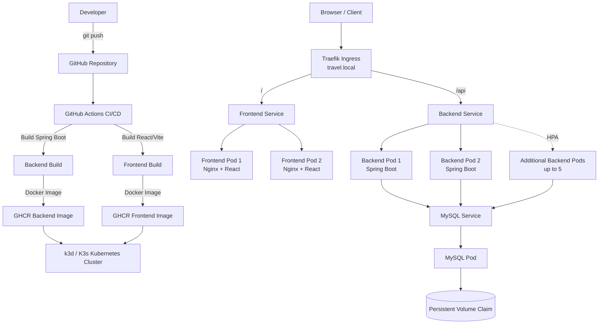
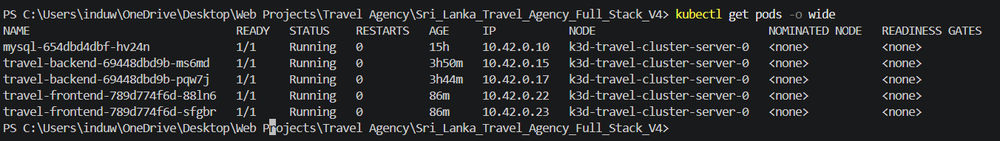
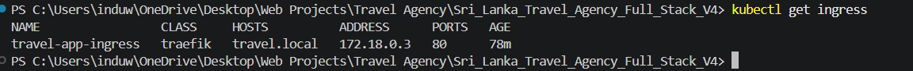
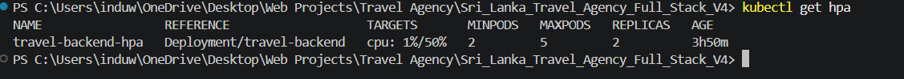
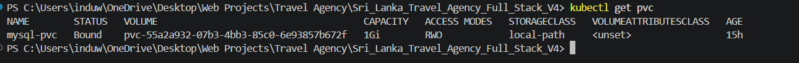

🌴 Sri Lanka Travel Agency — Cloud-Native DevOps & Kubernetes Project


A full-stack Sri Lanka Travel Agency application enhanced with a complete DevOps and Kubernetes workflow.
The project uses a React + Vite frontend, Spring Boot backend, and MySQL database, with containerization using Docker, CI/CD automation using GitHub Actions, image publishing through GitHub Container Registry (GHCR), and deployment to a local k3d/K3s Kubernetes cluster using Traefik Ingress.
This project demonstrates practical DevOps concepts including containerization, CI/CD, Kubernetes deployments, persistent database storage, health probes, self-healing, horizontal pod autoscaling, multiple replicas, configuration management, secrets, and full-stack ingress routing.
---
🚀 Technologies Used
Application Stack
React
Vite
Nginx
Java 21
Spring Boot 3.3.4
Maven
MySQL 8.4
DevOps Stack
Git
GitHub
GitHub Actions
Docker
GitHub Container Registry (GHCR)
Kubernetes
k3d / K3s
Traefik Ingress
Spring Boot Actuator
Horizontal Pod Autoscaler (HPA)
---
⚙️ DevOps Features
GitHub-based source control
Separate `devops-version-1` development branch
Automated Maven backend build using GitHub Actions
Dockerized Spring Boot backend
Multi-stage Dockerized React frontend
Nginx production frontend server
Backend and frontend Docker image publishing to GHCR
Kubernetes backend Deployment
Kubernetes frontend Deployment
Multiple backend replicas
Multiple frontend replicas
Kubernetes ClusterIP Services
Traefik Ingress routing
Spring Boot Actuator health endpoints
Kubernetes readiness probes
Kubernetes liveness probes
CPU and memory resource requests and limits
Horizontal Pod Autoscaler
Kubernetes self-healing
MySQL Deployment inside Kubernetes
MySQL persistent storage using PVC
Kubernetes ConfigMap
Kubernetes Secret management
Environment-variable based application configuration
Rolling Deployment support
Full-stack routing through one host
CI/CD pipeline verified successfully
> **Note:** The current CI/CD pipeline builds the backend with `-DskipTests`. Automated test execution can be added as a future improvement.
---
📁 Project Structure
```text
Sri_Lanka_Travel_Agency_Full_Stack_V4/
│
├── .github/
│   └── workflows/
│       └── ci-cd.yml
│
├── database/
│
├── frontend/
│   ├── src/
│   ├── public/
│   ├── Dockerfile
│   ├── .dockerignore
│   ├── nginx.conf
│   ├── package.json
│   └── vite.config.js
│
├── kubernetes/
│   ├── backend-deployment.yaml
│   ├── configmap.yaml
│   ├── frontend-deployment.yaml
│   ├── hpa.yaml
│   ├── ingress.yaml
│   ├── mysql-deployment.yaml
│   └── mysql-pvc.yaml
│
├── images/
│
├── scripts/
│
├── travel/
│   ├── src/
│   ├── Dockerfile
│   ├── pom.xml
│   └── mvnw
│
├── .gitignore
└── README.md
```
> `kubernetes/secret.yaml`, local environment files, private keys, frontend build output, backend build output, and `node_modules` are excluded from Git where appropriate.
---
🏗️ System Architecture

---
🔄 CI/CD Pipeline
The project uses GitHub Actions for Continuous Integration and container image publishing.
The workflow is triggered when code is pushed to:
```text
devops-version-1
```
Pipeline Flow
Checkout the repository.
Configure Java 21.
Cache Maven dependencies.
Give permission to the Maven wrapper.
Build the Spring Boot backend.
Authenticate to GitHub Container Registry.
Build the backend Docker image.
Push the backend image to GHCR.
Build the frontend Docker image.
Push the frontend image to GHCR.
Published Images
```text
ghcr.io/induwara09/travel-agency-backend:latest
ghcr.io/induwara09/travel-agency-backend:<commit-sha>

ghcr.io/induwara09/travel-agency-frontend:latest
ghcr.io/induwara09/travel-agency-frontend:<commit-sha>
```
This provides an automated workflow from source code → build → Docker image → container registry → Kubernetes-ready deployment.
---
🐳 Docker
Backend
The Spring Boot backend is packaged using:
```text
travel/Dockerfile
```
The backend container exposes:
```text
8080
```
Build locally:
```powershell
cd travel
.\mvnw.cmd clean package -DskipTests
docker build -t travel-agency-backend:1.0 .
```
---
Frontend
The React frontend uses a multi-stage Docker build.
Node.js builds the Vite application.
Nginx serves the generated production files.
React SPA routing is supported using Nginx.
API requests can be routed to the Spring Boot backend.
Build locally:
```powershell
cd frontend
npm ci
npm run build
docker build -t travel-agency-frontend:1.0 .
```
---
☸️ Kubernetes Cluster
The application is deployed to a local Kubernetes cluster using k3d/K3s.
Create the cluster:
```powershell
k3d cluster create travel-cluster
```
Check cluster nodes:
```powershell
kubectl get nodes
```
Check all application pods:
```powershell
kubectl get pods
```
Check deployments:
```powershell
kubectl get deployments
```
Check services:
```powershell
kubectl get services
```
---
🗄️ MySQL Deployment
MySQL runs inside the Kubernetes cluster.
The database configuration uses:
```text
Database: travel_db
Image: mysql:8.4
Service: mysql-service
```
Check the MySQL pod:
```powershell
kubectl get pods
```
Check the MySQL service:
```powershell
kubectl get service mysql-service
```
---
💾 MySQL Persistent Storage
A PersistentVolumeClaim (PVC) is used so MySQL data can survive pod recreation.
Configured storage:
```text
1Gi
```
Check the PVC:
```powershell
kubectl get pvc
```
Expected state:
```text
STATUS: Bound
```
This separates database storage from the MySQL pod lifecycle.
---
🔐 ConfigMap and Secret Management
Non-sensitive configuration is stored using a Kubernetes ConfigMap.
Examples:
```text
DB_URL
DB_USERNAME
DESTINATION_SEED_ENABLED
```
Sensitive values are stored using a Kubernetes Secret.
Example:
```text
MYSQL_ROOT_PASSWORD
```
Create the Secret safely:
```powershell
kubectl create secret generic mysql-secret `
  --from-literal=MYSQL_ROOT_PASSWORD="<YOUR_DB_PASSWORD>"
```
> Never commit real database passwords, tokens, API keys, `.env` files, private keys, or production secrets to Git.
---
🧩 Backend Kubernetes Deployment
The Spring Boot backend runs as a Kubernetes Deployment.
Configuration:
```text
Minimum replicas: 2
Container port: 8080
Service: travel-backend-service
```
Check the deployment:
```powershell
kubectl get deployment travel-backend
```
Check rollout status:
```powershell
kubectl rollout status deployment/travel-backend
```
A successful rollout displays:
```text
deployment "travel-backend" successfully rolled out
```
---
🎨 Frontend Kubernetes Deployment
The React/Nginx frontend runs as a Kubernetes Deployment.
Configuration:
```text
Replicas: 2
Container port: 80
Service: travel-frontend-service
```
Check the frontend deployment:
```powershell
kubectl get deployment travel-frontend
```
Check rollout status:
```powershell
kubectl rollout status deployment/travel-frontend
```
---
🌐 Traefik Ingress
Traefik Ingress is used to expose the application through one hostname:
```text
travel.local
```
Routing:
```text
/       → travel-frontend-service
/api    → travel-backend-service
```
Check the Ingress:
```powershell
kubectl get ingress
```
The final cluster should contain:
```text
travel-app-ingress
```
---
🔌 Local Ingress Testing
The k3d cluster used in this project was created without a direct Windows host port mapping for Traefik.
For local testing, forward Traefik to port `8084`:
```powershell
kubectl port-forward -n kube-system service/traefik 8084:80
```
Test the frontend:
```powershell
curl.exe -H "Host: travel.local" http://localhost:8084/
```
A successful request returns the frontend HTML.
Test the backend API:
```powershell
curl.exe -H "Host: travel.local" http://localhost:8084/api/destinations
```
A successful request returns destination JSON data.
---
❤️ Readiness and Liveness Probes
Spring Boot Actuator health endpoints are enabled for Kubernetes health monitoring.
Readiness Probe
```text
/actuator/health/readiness
```
Determines whether a backend pod is ready to receive traffic.
Liveness Probe
```text
/actuator/health/liveness
```
Determines whether the application is alive and healthy.
Kubernetes can restart unhealthy containers automatically.
This improves reliability and availability.
---
📈 Horizontal Pod Autoscaling
The backend uses a Horizontal Pod Autoscaler (HPA).
Configuration:
```text
Minimum replicas: 2
Maximum replicas: 5
Target CPU utilization: 50%
```
Check the HPA:
```powershell
kubectl get hpa
```
Check pod CPU and memory:
```powershell
kubectl top pods
```
During load testing, the deployment successfully scaled from:
```text
2 replicas → 3 replicas → 5 replicas
```
After load was removed and the stabilization period completed, it returned to:
```text
2 replicas
```
---
🧪 HPA Load Testing
One way to generate temporary load from PowerShell is:
```powershell
1..20 | ForEach-Object {
    Start-Job {
        while ($true) {
            try {
                Invoke-WebRequest -UseBasicParsing `
                  http://localhost:8081/api/destinations | Out-Null
            } catch {}
        }
    }
}
```
Monitor the HPA:
```powershell
kubectl get hpa -w
```
Stop the load:
```powershell
Get-Job | Stop-Job
Get-Job | Remove-Job
```
---
🛠️ Kubernetes Self-Healing
Kubernetes automatically maintains the desired number of backend replicas.
To test self-healing:
```powershell
kubectl get pods
kubectl delete pod <backend-pod-name>
kubectl get pods -w
```
When one backend pod is deleted, the Deployment controller automatically creates a replacement pod.
This confirms Kubernetes self-healing and improves application availability.
---
🔄 Rolling Updates
Kubernetes Deployments support rolling updates.
Monitor backend rollout:
```powershell
kubectl rollout status deployment/travel-backend
```
Monitor frontend rollout:
```powershell
kubectl rollout status deployment/travel-frontend
```
Rolling updates allow new application versions to be introduced while existing replicas continue serving requests.
---
🩺 Health and Troubleshooting Commands
View Pod Status
```powershell
kubectl get pods
```
Describe a Pod
```powershell
kubectl describe pod <pod-name>
```
View Application Logs
```powershell
kubectl logs <pod-name>
```
View Previous Crash Logs
```powershell
kubectl logs <pod-name> --previous
```
View Kubernetes Events
```powershell
kubectl get events --sort-by=.lastTimestamp
```
Check Services
```powershell
kubectl get services
```
Check Ingress
```powershell
kubectl get ingress
```
Check Autoscaling
```powershell
kubectl get hpa
```
Check Persistent Storage
```powershell
kubectl get pvc
```
Check Resource Usage
```powershell
kubectl top pods
```
---
🔎 Common Kubernetes Pod States
Status	Meaning	First Check
`Pending`	Scheduling, resource, or storage issue	`kubectl describe pod <name>`
`ContainerCreating`	Image, network, or volume setup	`kubectl describe pod <name>`
`ErrImagePull`	Kubernetes could not pull the image	Check registry/image/DNS
`ImagePullBackOff`	Repeated image pull failure	Inspect pod events
`CrashLoopBackOff`	Application repeatedly crashes	`kubectl logs <name> --previous`
`Running 0/1`	Container is running but not Ready	Check readiness probe
`Running 1/1`	Pod is healthy and Ready	Normal
---
🔐 Security
The project follows these security practices:
Database configuration is externalized.
Kubernetes Secrets are used for sensitive values.
ConfigMaps are used for non-sensitive values.
Environment variables are used for runtime configuration.
Real credentials are not stored directly in committed YAML.
`.env` files are excluded from Git.
Private key files are excluded from Git.
`kubernetes/secret.yaml` is excluded from Git.
GitHub Actions uses the repository-provided `GITHUB_TOKEN` for GHCR publishing.
---
📊 Useful Kubernetes Commands
```powershell
kubectl get nodes
kubectl get pods
kubectl get deployments
kubectl get services
kubectl get ingress
kubectl get hpa
kubectl get pvc
kubectl top pods
```
View backend logs:
```powershell
kubectl logs <backend-pod-name>
```
Monitor backend rollout:
```powershell
kubectl rollout status deployment/travel-backend
```
Monitor frontend rollout:
```powershell
kubectl rollout status deployment/travel-frontend
```
---
✅ Project Result
The Sri Lanka Travel Agency application was successfully:
Built using React, Spring Boot, Maven, and MySQL
Configured using environment variables
Containerized using Docker
Published to GitHub Container Registry
Integrated with GitHub Actions CI/CD
Deployed to Kubernetes using k3d/K3s
Configured with multiple frontend and backend replicas
Connected to MySQL running inside Kubernetes
Configured with MySQL persistent storage
Protected using Kubernetes Secrets
Configured using Kubernetes ConfigMaps
Monitored using Spring Boot Actuator health endpoints
Configured with readiness and liveness probes
Tested for Kubernetes self-healing
Configured with Horizontal Pod Autoscaling
Successfully scaled up to five backend replicas during load testing
Exposed through Traefik Ingress
Successfully tested through both frontend and backend ingress routes
Verified with a successful GitHub Actions pipeline
---
📸 Project Evidence / Screenshots
For a GitHub portfolio version of this project, create:
```text
docs/
└── screenshots/
    ├── github-actions-success.png
    ├── kubernetes-pods.png
    ├── kubernetes-deployments.png
    ├── kubernetes-ingress.png
    ├── kubernetes-hpa.png
    ├── mysql-pvc.png
    ├── backend-api-success.png
    ├── frontend-kubernetes.png
    └── website-home.png
```
Then add the screenshots to this section.
☸️ Kubernetes Pods
<!--

🚀 Kubernetes Deployment Rollout
<!--

🌐 Traefik Ingress
<!--

📈 Horizontal Pod Autoscaler
<!--

🗄️ MySQL Persistent Storage
<!--

✅ Backend API Test
<!--

🎨 Frontend on Kubernetes
<!--

🌴 Travel Agency Website
<!--

---
🧠 Key DevOps Learning Outcomes
This project provided practical experience with:
Git branching and repository management
Environment-based configuration
Docker image creation
Multi-stage frontend container builds
GitHub Actions workflow development
GitHub Container Registry
Kubernetes Deployments and Services
Persistent database storage
Kubernetes Secrets and ConfigMaps
Health checks and application probes
Self-healing
Horizontal Pod Autoscaling
Traefik Ingress routing
CI/CD troubleshooting
Kubernetes troubleshooting
Full-stack application deployment
---
🔮 Future Improvements
Possible next improvements include:
Run automated backend tests in GitHub Actions
Add frontend linting and automated tests
Use immutable image tags in Kubernetes manifests
Add Helm or Kustomize
Add Prometheus and Grafana
Add centralized logging
Add HTTPS/TLS
Add a real domain name
Deploy to AWS EKS, Azure AKS, or Google GKE
Manage infrastructure using Terraform
Use an external secret manager for production
---
👨‍💻 Author
Induwara
Computer Systems Engineering Undergraduate
Sri Lanka Institute of Information Technology (SLIIT)
GitHub: Induwara09
---
📌 Repository
GitHub Repository:
Induwara09/Travelling_Agency_Web_App
DevOps Branch:
`devops-version-1`
---
> This repository is an educational DevOps project demonstrating how a full-stack application can move from local development to a containerized, automated, and Kubernetes-managed deployment environment.